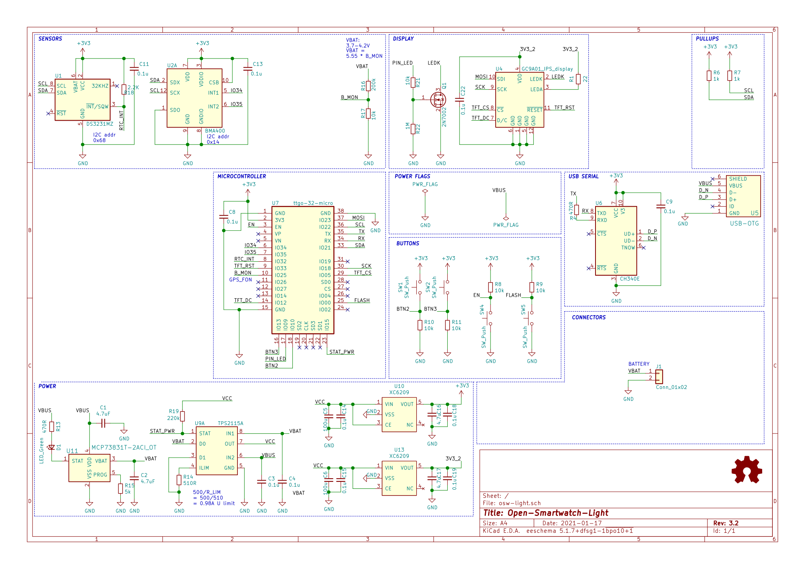

# Open-Smartwatch KiCAD files

Repo for kicad schematic, board and gerber files. This project is in development and is not ready for release.

## Tools

To view/modify the files from this repository, install KiCAD from: [https://kicad.org](https://kicad.org)

Also, add the following Symbol/Footprint library to KiCAD: [https://github.com/Open-Smartwatch/Kicad-Libraries](https://github.com/Open-Smartwatch/Kicad-Libraries)

## Schematic

## Plots

## BOM

See: [https://htmlpreview.github.io/?https://github.com/Open-Smartwatch/open-smartwatch-light/blob/master/docs/bom/osw-light-ibom_v.html](https://htmlpreview.github.io/?https://github.com/Open-Smartwatch/open-smartwatch-light/blob/master/docs/bom/osw-light-ibom_v.html)
